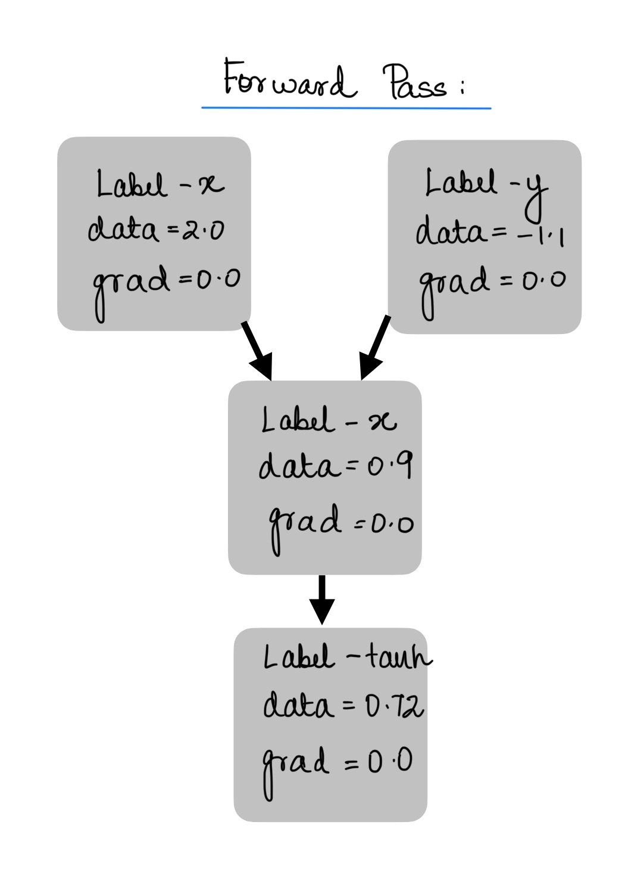
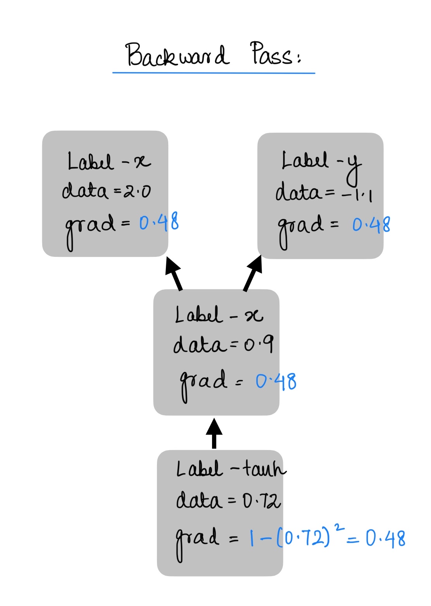

## tinygrad

this is tinygrad - an [autograd](https://docs.pytorch.org/tutorials/beginner/blitz/autograd_tutorial.html) engine along with a neural net library which has been inspired from [pytorch](https://pytorch.org/) , it is inspired from karpathy's version of [micrograd](https://github.com/karpathy/micrograd) and I have added a few non linearities (activation function) including relu which are used in real life.

The process of how I went about implementing this has been shown with appropriate comments in the [notebook](tinygrad_notebook.ipynb)
This also has a pytorch like API and can be used for simple tasks like binary classification.

shown is a simple example as to how the forward pass and backward pass work:

